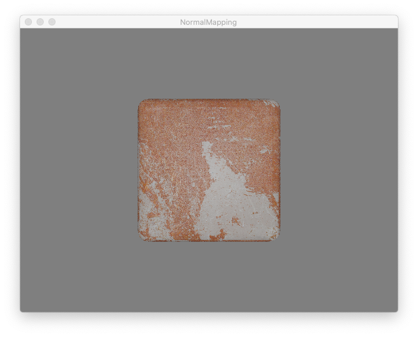

## OpenGL NormalMapping with Apple's ModelIO framework.

This demo is written in Objective-C. The advantage is support by Apple's OpenGL Profiler.

Loading of the meshes and associated texture files are performed automatically using the methods of Apple's Model I/O framework.

Implementation of the main rendering loop requires matrix and vector operations which are provided by Apple's GLKit framework. 

A diffuse and a normal map must be specified in the materal file (.mtl) or the demo might crash.

Compiled with XCode 8.3.2 running under macOS 10.12.x
